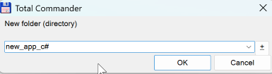
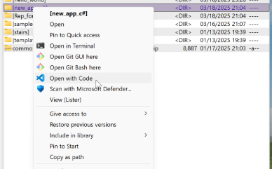
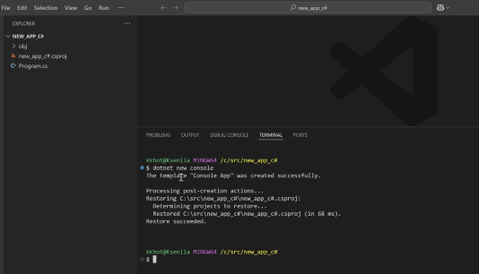
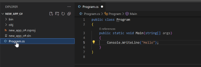

Создание новой программы в С#
=========

Для простоты рассуждений допустим, что:
- новые программы мы создаем в каталоге с:\src (в вашем случе катаалог м б другим , но мы будем оприраться на этот адрес)

1. В total comander откроем c:\src и создадим папку new_app_c#

1. Открыть VS Code в папке new_app_c#  

1. Вызвать в консоли открывшегося окна команду dotnet new console, которая сгенерирует стартовый проект

1. Редактируем появившийся в левом окне файл Program.cs:
описываем в этом файле публичный класс Program
и функцию:`public static Main(string[] args)`

1. Внутри функции Main пишем операторы программы.
